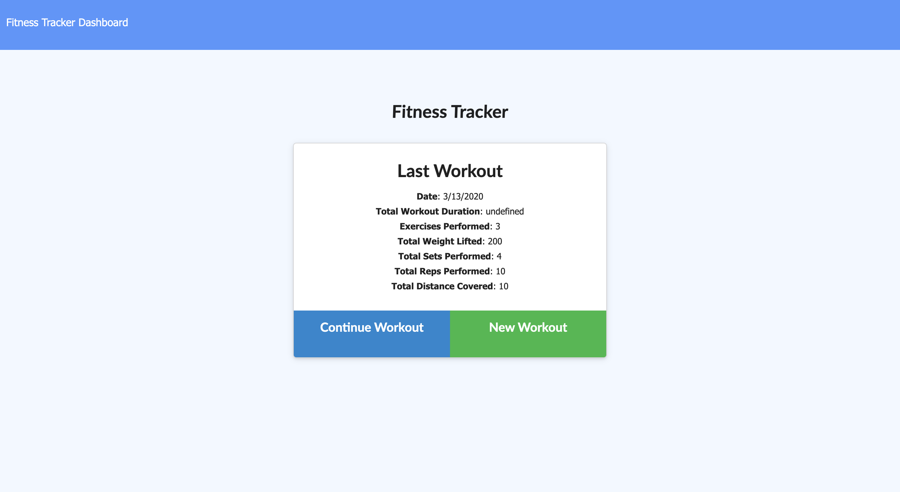
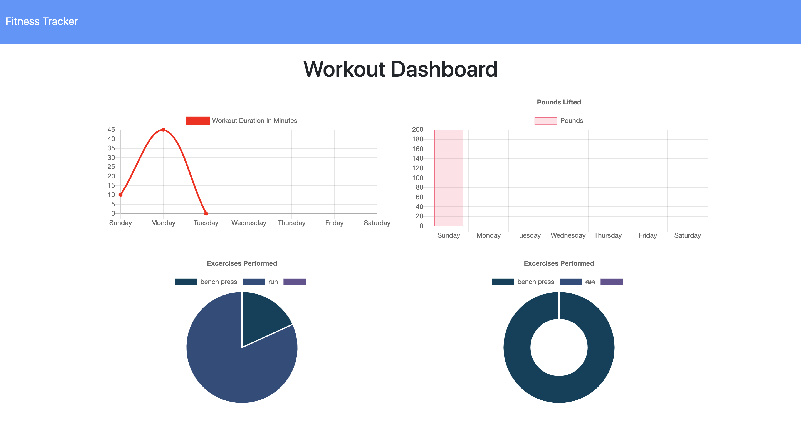
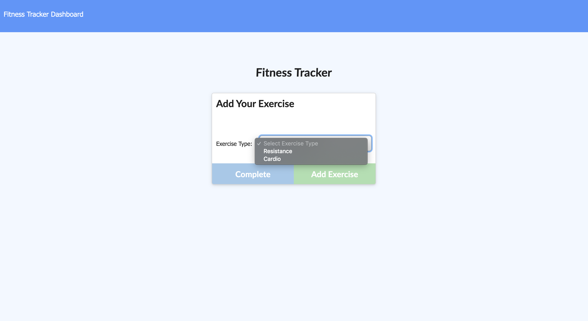
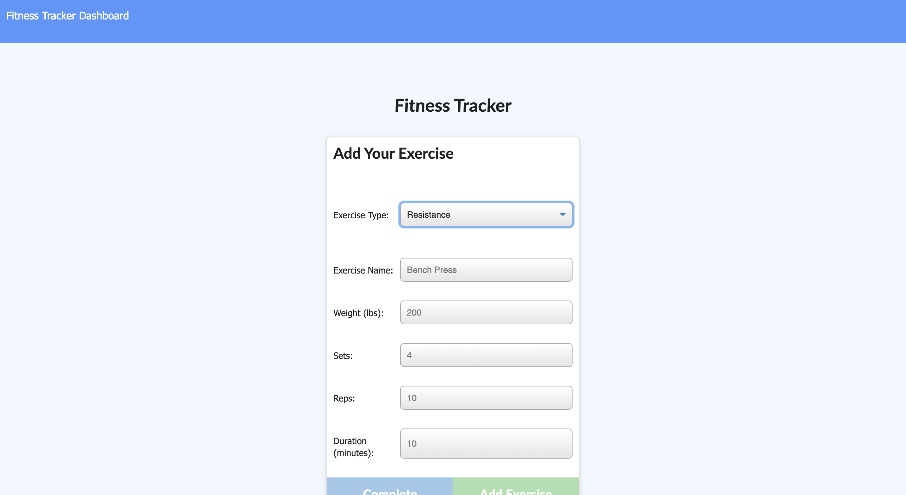

# 🗳 PROJECT NAME: Fitness Tracker

# 💻 Demo 

## 🗒 Project Description 
 
 This project utilizes Node, Express, and MongoDB (mLab) to track all activities taken at a certain workout routine.
 
## ✨ TABLE OF CONTENTS 

            1. Usage

            2. Languages

            3. License

 
            
## 📚 Usage 
 
 Runs on localhost:8080 and deployed via https://radiant-castle-11065.herokuapp.com
 
## 🙊 Languages Needed 
 
 JavaScript, Node, Express, and MongoDB
 
## 💳 License 
 
 This project is under the MIT license
 
 
## 🙌👏 Questions? 
  
This project exists thanks to this person who contributed. 
